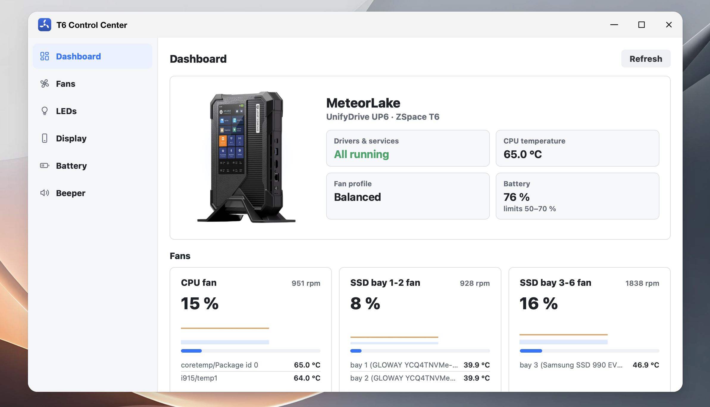

# Linux Driver for UnifyDrive UP6

Out-of-tree Linux drivers and userspace tools for the UnifyDrive UP6
(also labelled ZSpace T6 or PA60), so you can run a generic Linux kernel
and distribution on it instead of the vendor OS.

Tested on x86-64 Debian 12 and on FygoOS / fnOS (kernel 6.18).

## Repository layout

```
kernel/       DKMS kernel modules
crates/       Cargo workspace with all Rust userspace (shared target/ and lockfile)
panel/        front-panel UI (www/), its admin page (web/) and the Electron kiosk shell (app/)
packaging/    install-dkms.sh, build-fpk.sh and the FygoOS package skeletons (fpk/)
assets/       README images
```

## Components

### Kernel modules (DKMS, any Debian)

| directory | module | covers |
|---|---|---|
| [`kernel/t6-platform-dkms/`](kernel/t6-platform-dkms/) | `t6_platform` | EC platform driver: fans and temperatures (hwmon), LCD backlight, all LEDs (EC + GPIO), beeper, front-panel keys, battery telemetry and charge thresholds |
| [`kernel/focaltech-ft8722-dkms/`](kernel/focaltech-ft8722-dkms/) | `ft8722_ts` | front-panel touchscreen |

### Userspace daemons (Rust, any Debian)

| directory | binary | covers |
|---|---|---|
| [`crates/t6-hw-rs/`](crates/t6-hw-rs/) | *(library)* | shared hardware readers (sysfs, `/proc`, daemon status files) used by `t6-webd` and `t6-paneld` |
| [`crates/t6-fand/`](crates/t6-fand/) | `t6-fand` | fan policy daemon over the hwmon interface: profiles (silent / balance / performance / custom), temperature curves, smoothing, fail-safe |
| [`crates/t6-ledd/`](crates/t6-ledd/) | `t6-ledd` | indicator daemon: LED policy, night mode, startup and event beeps, and automatic drive-bay LEDs (white when a drive is present, red blink on a RAID/drive fault) |

### Web and front-panel apps (for FygoOS)

| directory | binary | covers |
|---|---|---|
| [`crates/t6-webd/`](crates/t6-webd/) | `t6-webd` | Control Center web backend and UI (`crates/t6-webd/www/`) for fans, LEDs, display brightness, battery charge limits, the beeper and driver health / DKMS repair. Runs as a FygoOS/fnOS desktop app behind the system gateway; also usable standalone. |
| [`crates/t6-paneld/`](crates/t6-paneld/) | `t6-paneld` | front-panel backend: serves [`panel/www/`](panel/www/) to the on-device kiosk and, behind the FygoOS gateway, to signed-in users (files, storage, network, Thunderbolt, notifications, system); also the admin page [`panel/web/`](panel/web/) (FygoOS desktop, administrators only) to turn the front-panel app on/off, set brightness and colour correction, and restart it |
| [`panel/app/`](panel/app/) | — | Electron kiosk shell, launched on a private weston compositor by `run-kiosk.sh` |

<p align="center"></p>
<p align="center"><sub>T6 Control Center in the fnOS desktop: device overview, fan status and driver health at a glance.</sub></p>

## Prerequisite

Kernel modules (DKMS):

```bash
sudo apt install dkms build-essential linux-headers-$(uname -r)
```

Daemons and web app: a Rust toolchain (`cargo`, via [rustup](https://rustup.rs)).
All crates are members of one workspace in `crates/`, so build from there
(`cd crates && cargo build --release`); binaries land in `crates/target/release/`.

FygoOS packages: [`fygopack`](https://developer.fygonas.com/docs/cli/fygopack/)
on `PATH`, and for `t6-panel` a Node.js toolchain to fetch the Electron runtime
(`cd panel/app && npm ci`).

Front-panel kiosk: the panel runs an Electron shell on a private **weston**
compositor, so weston must be installed (`sudo apt install weston`); the
t6-panel package's install step checks for it.

Wi-Fi hotspot (optional): the hotspot uses NetworkManager's shared mode, which
needs `dnsmasq-base` and `iptables` for the access point's DHCP and NAT —
`sudo apt install dnsmasq-base iptables`.

GPU acceleration: the Meteor Lake iGPU (PCI `0x7d55`)
needs **Mesa ≥ 23** to drive its `iris` GL/EGL driver. Debian 12's stock Mesa
(22.3) does not recognize it, so the whole graphics stack — the weston
compositor *and* the Electron panel — silently falls back to software
rendering (llvmpipe / SwiftShader), which pegs the CPU and overheats the box.
This is a system-library limitation we cannot work around in our own code, so
install the backports GL stack:

```bash
sudo apt install -t bookworm-backports \
  libgl1-mesa-dri libegl-mesa0 libglx-mesa0 libgbm1
```

Verify weston reports the real GPU (`GL renderer: Mesa Intel(R) Arc(tm)
Graphics (MTL)`, not `llvmpipe`) in its log. FygoOS/fnOS already ships the
matching Vulkan and gallium backports; only these GL packages need bumping.

## Install For Plain Debian (skip for FygoOS!)

### Kernel modules

```bash
sudo ./packaging/install-dkms.sh
```

### Userspace daemons

Each daemon builds with `cargo` from the `crates/` workspace and installs a
systemd unit; see
[`crates/t6-fand/README.md`](crates/t6-fand/README.md) and
[`crates/t6-ledd/README.md`](crates/t6-ledd/README.md).

## Install For FygoOS / fnOS: all-in-one packages

You may simply **install from Releases**, or build from source:

```bash
./packaging/build-fpk.sh              # all three
./packaging/build-fpk.sh t6-control    # or just one
```

stages each package from `packaging/fpk/<name>/` under `build/fpk/`, assembles
its payload from `kernel/`, `crates/` and `panel/`, and writes the FygoOS
packages (.fpk) to `build/`:

| package | contents |
|---|---|
| `t6-drivers.fpk` | the two DKMS modules + `install-dkms.sh`, built and loaded on install; a `t6-drivers-check` unit rebuilds them at boot after a kernel update |
| `t6-control.fpk` | the `t6-fand`, `t6-ledd` and `t6-webd` daemons (Control Center web app); depends on `t6-drivers` |
| `t6-panel.fpk` | the front-panel backend (`t6-paneld`) + the Electron kiosk shell, started on boot; depends on `t6-control` |

Install them from the App Center's manual-installation entry, or with
`appcenter-cli install-fpk <file>` (first install only — to upgrade an
installed package, use the App Center UI).

## Acknowledgements

- The Wi-Fi hotspot (AP-mode) support adapts the NetworkManager sequence from
  [fn-wifi-hotspot](https://github.com/wjz304) by Ing (wjz304), MIT-licensed.
- The fnOS/FygoOS integration patterns were informed by the community
  [RROrg/fn-apps](https://github.com/RROrg/fn-apps) collection.
- The native fnOS RPC client (`t6-paneld`'s `fnos` module) implements the
  `com.trim.main` WebSocket auth protocol independently in Rust; the protocol was
  understood with reference to the Apache-2.0 [`fnos`](https://www.npmjs.com/package/fnos)
  npm package by Timandes White. No third-party code or binaries are bundled.

--------

<p align="center"></p>
