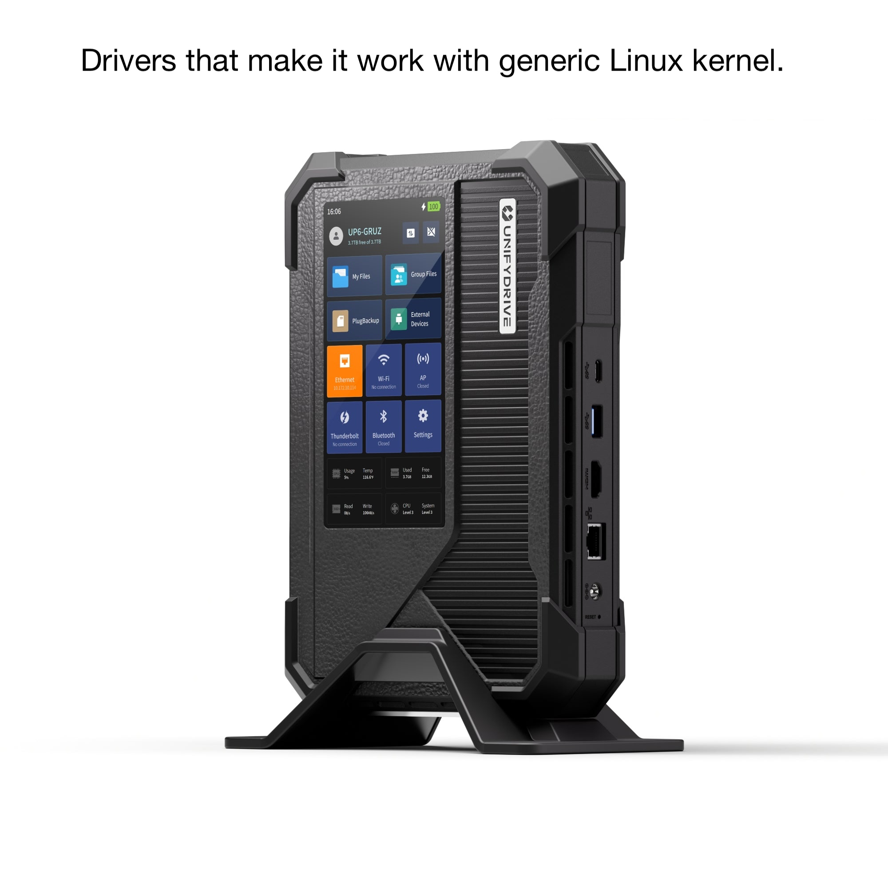

# Linux Driver for UnifyDrive UP6

Out-of-tree Linux drivers and userspace tools for the UnifyDrive UP6
(also labelled ZSpace T6 or PA60), so you can run a generic Linux kernel
and distribution on it instead of the vendor OS.

Tested on x86-64 Debian 12 and on FygoOS / fnOS (kernel 6.18).

## Components

### Kernel modules (DKMS, any Debian)

| directory | module | covers |
|---|---|---|
| [`kernel/t6-platform-dkms/`](kernel/t6-platform-dkms/) | `t6_platform` | EC platform driver: fans and temperatures (hwmon), LCD backlight, all LEDs (EC + GPIO), beeper, front-panel keys, battery telemetry and charge thresholds |
| [`kernel/focaltech-ft8722-dkms/`](kernel/focaltech-ft8722-dkms/) | `ft8722_ts` | front-panel touchscreen |

### Userspace daemons (Rust, any Debian)

| directory | binary | covers |
|---|---|---|
| [`crates/t6-fand/`](crates/t6-fand/) | `t6-fand` | fan policy daemon over the hwmon interface: profiles (silent / balance / performance / custom), temperature curves, smoothing, fail-safe |
| [`crates/t6-ledd/`](crates/t6-ledd/) | `t6-ledd` | indicator daemon: LED policy, night mode, startup and event beeps, and automatic drive-bay LEDs (white when a drive is present, red blink on a RAID/drive fault) |

### Web daemon (for FygoOS)

| directory | binary | covers |
|---|---|---|
| [`crates/t6-webd/`](crates/t6-webd/) | `t6-webd` | web backend and UI for fans, LEDs, display brightness, battery charge limits and the beeper. Runs as a FygoOS/FnOS desktop app behind the system gateway; also usable standalone. |

## Prerequisite

Kernel modules (DKMS):

```bash
sudo apt install dkms build-essential linux-headers-$(uname -r)
```

Daemons and web app: a Rust toolchain (`cargo`, via [rustup](https://rustup.rs)).

## Install For Plain Debian (skip for FygoOS!)

### Kernel modules

```bash
sudo ./packaging/install-dkms.sh
```

Builds and installs both DKMS modules for the running kernel and enables
`t6_platform` at boot. Re-run after a version bump to upgrade;
`sudo ./packaging/install-dkms.sh --remove` uninstalls.

### Userspace daemons

Each daemon builds with `cargo` and installs a systemd unit; see
[`crates/t6-fand/README.md`](crates/t6-fand/README.md) and
[`crates/t6-ledd/README.md`](crates/t6-ledd/README.md).

## Install For FygoOS / fnOS: all-in-one packages

```bash
./packaging/build-fpk.sh
```

produces two FygoOS packages (.fpk) in `build/`:

| package | contents |
|---|---|
| `t6-drivers.fpk` | the two DKMS modules, built and loaded on install |
| `t6control.fpk` | the `t6-fand` and `t6-ledd` daemons and the web app; depends on `t6-drivers` |

Install them from the App Center's manual-installation entry, or with
`appcenter-cli install-fpk <file>`.


## Notes

### Safety for other machines

- **Kernels**: everything builds warning-free against 6.1 (Debian 12), 6.12 (Debian 13) and 6.18 (fnOS).
- **Hardware gate**: both modules refuse to load unless DMI reports `Insyde` / `MeteorLake` / BIOS version `T6MTLJKJBOXV*`. The global UP6 / PA60 ships the same BIOS image, so it is covered. Other boards can be added to the DMI table together with their IRQ line.
- Both accept `force=1` to bypass the gate for testing an unknown board.

--------

<p align="center"></p>
