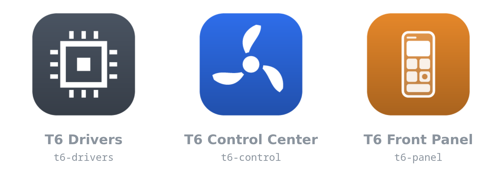
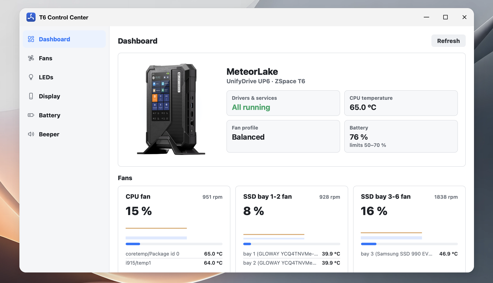
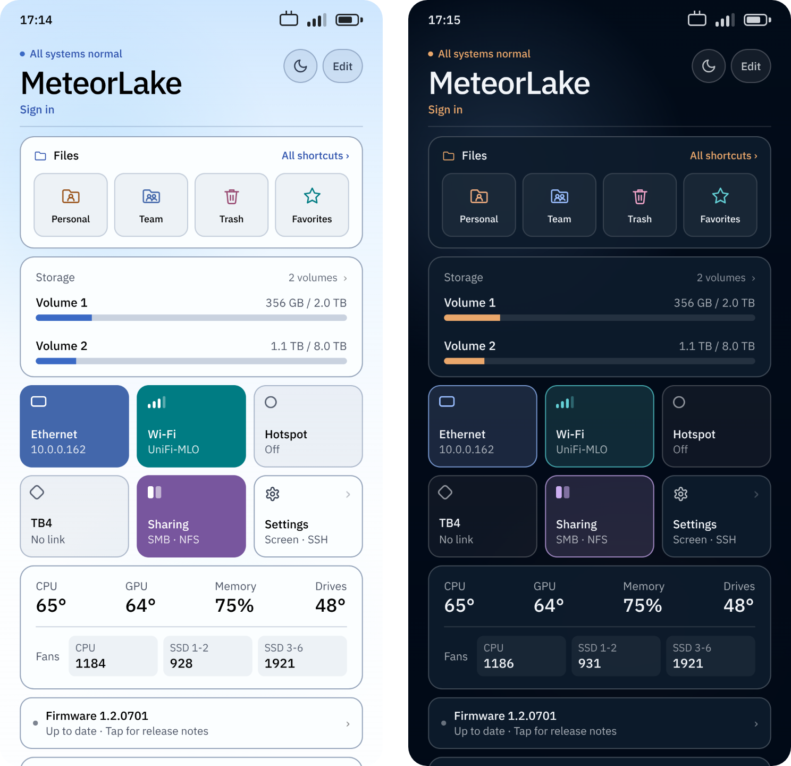

# Linux Driver for UnifyDrive UP6

Out-of-tree Linux drivers and userspace tools for the UnifyDrive UP6 (also labelled T6 or PA60), so you can run a generic Linux kernel and distribution on it instead of the vendor OS.

Tested on x86-64 Debian 12 and on FygoOS / fnOS (kernel 6.18).

<p align="center"></p>

## Components

### Kernel modules (DKMS, any Debian)

| directory | module | covers |
|---|---|---|
| [`kernel/t6-platform-dkms/`](kernel/t6-platform-dkms/) | `t6_platform` | EC platform driver: fans, LCD backlight, LEDs, beeper, buttons, battery |
| [`kernel/focaltech-ft8722-dkms/`](kernel/focaltech-ft8722-dkms/) | `ft8722_ts` | front-panel touchscreen |
| [`kernel/ite-it6616-dkms/`](kernel/ite-it6616-dkms/) | `ite_it6616` | HDMI-to-MIPI DSI bridge |

### Userspace daemons (Rust, any Debian)

| directory | binary | covers |
|---|---|---|
| [`crates/t6-hw-rs/`](crates/t6-hw-rs/) | *(library)* | shared hardware readers |
| [`crates/t6-fand/`](crates/t6-fand/) | `t6-fand` | fan policy daemon |
| [`crates/t6-ledd/`](crates/t6-ledd/) | `t6-ledd` | indicator daemon: LED policy, event beeps |

### Web and front-panel apps (for FygoOS)

| directory | binary | covers |
|---|---|---|
| [`crates/t6-webd/`](crates/t6-webd/) | `t6-webd` | Control Center web backend and UI |
| [`crates/t6-paneld/`](crates/t6-paneld/) | `t6-paneld` | front-panel backend |
| [`panel/app/`](panel/app/) | — | kiosk for the front-panel touch screen |

<p align="center"></p>
<p align="center"><sub>Control Center</sub></p>

<p align="center"></p>
<p align="center"><sub>Front-panel touch screen in light and dark theme.</sub></p>

## Prerequisites

### For running

- **FygoOS / fnOS packages** take care of their own dependencies: they automatically install what is missing.
- **Plain Debian** (kernel modules): DKMS and headers for the running kernel,
  `sudo apt install dkms linux-headers-$(uname -r)`.
- Optional, Wi-Fi **hotspot**: `sudo apt install dnsmasq-base iptables` (DHCP
  and NAT for NetworkManager's shared mode).

### For building

- **Rust** toolchain (via [rustup](https://rustup.rs)).
- FygoOS packages: [`fygopack`](https://developer.fygonas.com/docs/cli/fygopack/).
- `t6-panel` additionally:
  - **Node.js** to fetch the Electron runtime: `cd panel/app && npm ci`;
  - for the video player's mpv bundle and libva:

    ```bash
    sudo apt install meson ninja-build patchelf libdrm-dev libwayland-dev \
      libx11-dev libxext-dev libxfixes-dev libx11-xcb-dev libxcb1-dev libxcb-dri3-dev
    ```

    (mpv's Debian packages and the libva source are committed, so no
    downloads are needed.)

## Install For Plain Debian (skip for FygoOS!)

- Kernel modules: `sudo ./packaging/install-dkms.sh`

- Userspace daemons: Each daemon builds with `cargo` from the `crates/` workspace. See
[`crates/t6-fand/README.md`](crates/t6-fand/README.md) and
[`crates/t6-ledd/README.md`](crates/t6-ledd/README.md).

## Install For FygoOS / fnOS: all-in-one packages

You may simply **download and install from Releases**, or build from source:

```bash
./packaging/build-fpk.sh              # all three
./packaging/build-fpk.sh t6-control    # or just one
```

stages each package from `packaging/fpk/<name>/` under `build/fpk/`, assembles
its payload from `kernel/`, `crates/` and `panel/`, and writes the FygoOS
packages (.fpk) to `build/`:

| package | contents |
|---|---|
| `t6-drivers.fpk` | the three DKMS modules + `install-dkms.sh`, built and loaded on install; a `t6-drivers-check` unit rebuilds them at boot after a kernel update |
| `t6-control.fpk` | the `t6-fand`, `t6-ledd` and `t6-webd` daemons (Control Center web app); depends on `t6-drivers` |
| `t6-panel.fpk` | the front-panel backend (`t6-paneld`), the Electron kiosk and a bundled mpv video/music player, started on boot; depends on `t6-control` and `appliance-compositor` |

`t6-panel` runs on **appliance-compositor**, a separate project: one Wayland
compositor (weston + appliance-shell) on every display and one PipeWire sound
server, shared by screen apps (the front panel, a TV app, …). The panel uses
only its runtime contract, so this repository builds without it; each
[release](../../releases) also carries `appliance-compositor.fpk`.

Install them from the App Center's manual-installation entry, or with
`appcenter-cli install-fpk <file>`, in this order: `t6-drivers`,
`t6-control`, `appliance-compositor`, `t6-panel`.


## Repository layout

```
kernel/       DKMS kernel modules
crates/       Cargo workspace with all Rust userspace (shared target/ and lockfile)
panel/        front-panel UI (www/), its admin page (web/), the Electron kiosk shell (app/,
              with its appliance-compositor registration) and the video player's config (mpv/)
packaging/    install-dkms.sh, build-fpk.sh, the FygoOS package skeletons (fpk/) and the
              pinned mpv/libva sources (mpv/)
assets/       README images
```


------

## Acknowledgements

- The Wi-Fi hotspot (AP-mode) support adapts the NetworkManager sequence from
  [fn-wifi-hotspot](https://github.com/wjz304) by Ing (wjz304), MIT-licensed.
- The fnOS/FygoOS integration patterns were informed by the community
  [RROrg/fn-apps](https://github.com/RROrg/fn-apps) collection.
- The native fnOS RPC client (`t6-paneld`'s `fnos` module) implements the
  `com.trim.main` WebSocket auth protocol independently in Rust; the protocol was
  understood with reference to the Apache-2.0 [`fnos`](https://www.npmjs.com/package/fnos)
  npm package by Timandes White. No third-party code or binaries are bundled.
